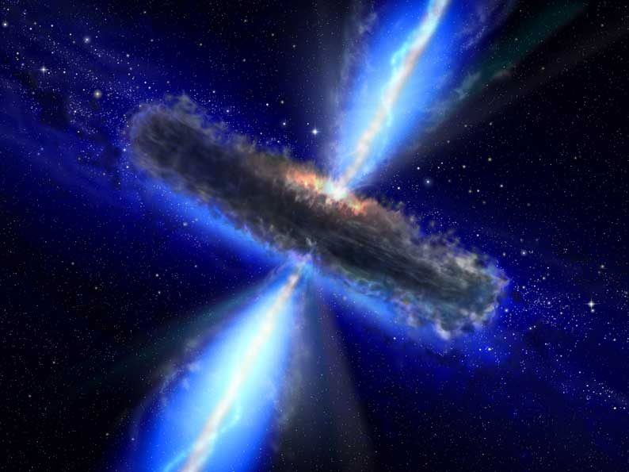

# Matt Zhiyuan Pei Astrophysical Zone

# Welcome to my work-page

I'm Dr. Zhiyuan Pei (Matt for easy remember), currently an associate professor in the divison of astronomy, school of physics and materials science, Guangzhou University (China). My reaerch focuses on active galactic nuclei and high energy process/mechanism in extragalactic astrophysics, manily lying in relativistic jets, black holes and accretion, TeV and neutrino emission physics.   

# Something about me

* You can find my curriculum vitae here: [CV](http://spee.gzhu.edu.cn/sz/rylb.html) 
* 个人简历（学院网页版本）\
1987年生于广东广州，博士毕业于意大利帕多瓦大学物理学系，随后入职广州大学。主要研究兴趣为活动星系核多波段性质、黑洞与喷流物理等。目前以第一作者或通讯作者发表SCI论文9篇(其中JCR一区文章6篇)，另以合作者共发表文章五十余篇(其中包含Science、Nature和PRL等国际著名刊物），h指数18 (数据来源于谷歌学术)。现为高海拔宇宙线观测站(LHAASO)科学合作组成员，费米空间望远镜(Fermi-LAT)国际合作组成员。主持国家自然科学青年基金项目一项，完成中国博士后科学基金面上项目一项，参与国基项目多项。指导本科生参与广州大学“大学生创新训练项目”国家级项目三项、省级项目一项；“挑战杯”项目一项，并获得省赛一等奖。目前担任广州大学首届天文本科专业天文221班主任。

# Publications (Only leading papers in recent three years are listed)

1. Pei Zhiyuan*, Fan Junhui, Yang Jianghe et al., [The Estimation of Fundamental Physics Parameters for Fermi-LAT Blazars](https://iopscience.iop.org/article/10.3847/1538-4357/ac3aeb), Astrophysical Journal, 2022, 925, 97;
2. Huang Danyi, Li Ziyan, Liao Jiru, Huang Xiulin, Li Chengfeng, Qian Yanjun, Pei Zhiyuan* and Fan Junhui, [Constraining the γ-Ray Emission Region for Fermi-detected FSRQs by the Seed Photon Approach](https://iopscience.iop.org/article/10.1088/1538-3873/ac80d3), Publications of the Astronomical Society of the Pacific, 2022, 134, 084102;
3. Pei Zhiyuan*, Fan Junhui, Yang Jianghe and Bastieri Denis, [Beamed and Unbeamed Emission of γ-Ray Blazars](https://iopscience.iop.org/article/10.1088/1538-3873/abb78f), Publications of the Astronomical Society of the Pacific, 2020, 132, 114102;
4. Pei Zhiyuan*, Fan Junhui, Yang Jianghe and Bastieri Denis, [The estimation of γ-ray Doppler factor for Fermi/LAT-detected blazars](https://www.cambridge.org/core/journals/publications-of-the-astronomical-society-of-australia/article/estimation-of-ray-doppler-factor-for-fermilatdetected-blazars/35AC6765C8B67886D6D46BFC30991519#), Publications of the Astronomical Society of Australia, 2020, 37, 043;
5. Pei Zhiyuan*, Fan Junhui*, Bastieri Denis et al., [Radio core dominance of Fermi/LAT-detected AGNs, Science China Physics](https://link.springer.com/article/10.1007/s11433-019-1454-6), Mechanics & Astronomy, 2020, 63, 005;
6. Pei Zhiyuan, Fan Junhui*, Bastieri Denis* et al., [The relationship between the radio core-dominance parameter and spectral index in different classes of extragalactic radio sources (III)](https://iopscience.iop.org/article/10.1088/1674-4527/20/2/25), Research in Astronomy and Astrophysics, 2020, 20, 025;
7. Pei Zhiyuan, Fan Junhui*, Bastieri Denis et al., [The relationship between the radio core-dominance parameter and spectral index in different classes of extragalactic radio sources (II)](https://iopscience.iop.org/article/10.1088/1674-4527/19/5/70), Research in Astronomy and Astrophysics, 2019, 19, 70.

# Teaching

* [复变函数与积分变换](http://www.gzhu.edu.cn/)
* 大学物理（理论）
* 天文学导论

